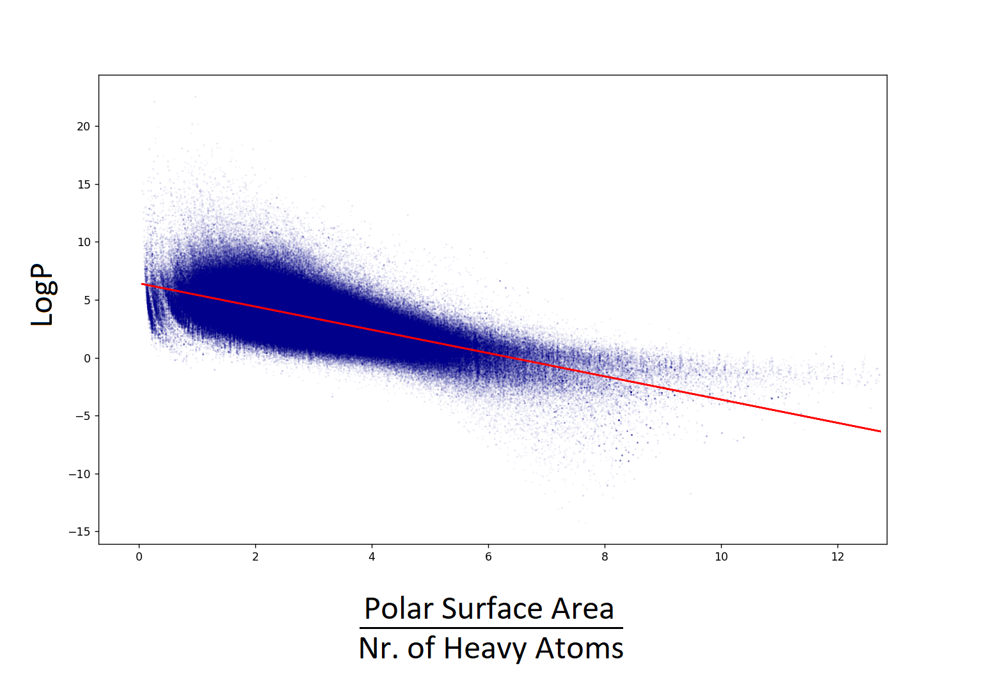

# Pharmaceutical Compound Data Mining

## Intro

In this project, data mining (principal component analysis) is performed on a dataset of over 40,000 bioactive compounds, encompassing information on their structure and chemical properties.

 

   
  Projection of compounds color coded 
  by clinical research phase reached
 

 

The data obtained from the [ChEMBL](https://www.ebi.ac.uk/chembl/) database is extensive, but incomplete. Data cleaning and data augmentation are performed, whereby missing values are scraped or estimated through a linear regression model, and double bond equivalents are calculated for each molecule to quantify its rigidity. In the cleaned dataset, each compound has different entries pertaining to its polarity, flexibility, bulkiness, composition, and hydrogen bond donors and acceptors. 

Dimensionality reduction is performed through principal component analysis where the 10-dimensional dataset is transformed to a 4-dimensional dataset maintaining ~85% of the original variation. The resulting data is plotted in 3D (the further dimension being represented through colour), where interesting patterns can be observed. 

If you would like to run the code and take a look at the 3D plots yourself, you can do so by following the instructions in the Usage section. 

 

## Data Cleaning and Augmentation

### Scraping

As mentioned above, many of the entries in the datasets obtained from ChEMBL were missing crucial information pertaining to the compounds' properties. However, [PubChem](https://pubchem.ncbi.nlm.nih.gov/) is an excellent resource where many of these properties can be retrieved. I built a webscraper in Selenium that can search PubChem for the names of compounds with missing properties, check whether the requested page is a match, and if so, scrape molecular weight, heavy atom count, rotatable bond count, topological polar surface area, and number of hydrogen bond donors and acceptors. The significance of these entries is discussed in the Analysis section of this readme. 

 

### LogP Estimation

In chemistry, the logarithm of the partition coefficient (logP) is a very useful metric to describe molecular properties. It is defined as the logarithm of the ratio of a compound's concentrations in a hydrophobic solvent (usually octanol) and water. Though more importantly, being a measure of how well a molecule will dissolve in polar vs. nonpolar solvents, it is a very effective way of quantifying how polar a molecule is. 

Unfortunately, this metric can frequently not be retrieved from PubChem, and is missing from many ChEMBL dataset entries. This is due to the low solubility of many compounds in one or both solvents. 

However, the full ChEMBL dataset (including a majority of experimental compounds that have not been named, and thus cannot be scraped and included in the data mining) contains over one million compounds with logP values, polar surface area calculations, and heavy atom counts. The ratio between a molecule's polar surface area and its size can be used for a rough estimate of the compound's logP as shown in the plot below. 

 

   
  Scatter plot of logP values and corresponding 
  polar surface area to heavy atom number ratio
 

 

Extrapolation through simple linear regression is adequate for the purposes of data imputation, and has thus been executed in this project. More accurate methods for logP simulation do exist, but they do not lend themselves to quickly calculate this value for thousands of compounds. 

 

### Double Bond Equivalents

A further, crucial property of a molecule is its rigidity. This can be inferred from the molecular formula and is encapsulated in the measure of double bond equivalents, which describe how unsaturated a molecule is. Each double bond, and each ring in a molecule contributes to its rigidity and accounts for one double bond equivalent. The double_bond_equivalents.py script parses the formula and calculates this metric so that it can be added to the cleaned dataset.

 

## Analysis

### The Data

The cleaned and augmented dataset lists the properties of over 40,000 bioactive compounds. Besides name and chemical formula, which are not relevant for the statistical analysis, each compound has 10 or 11 entries which do play a role; 9 of these quantify properties that describe the chemical properties of these molecules. 

#### Size

- Molecular weight: the sum of the mass of all constituent atoms within the molecule 
- Heavy atom count: the number of non-hydrogen atoms in the molecule 

#### Flexibility

- Rotatable bond count: the number of bonds in the molecule that can freely rotate around their axis. 
- Double bond equivalents: the number of double bonds or ring closures present in the molecule. 

#### Polarity

- LogP: a measure of how hydrophobic (i.e. non water-soluble) a molecule is 
- Topological polar surface area: the surface area in Å2 that is allocated to polar atoms (such as N and O, and the Hs linked to them) 

#### Composition

- Inorganic Flag: a binary value showing whether a compound contains carbon-carbon bonds 
- Hydrogen bond donor count: the number of hydrogens bound to polar atoms, which can be donated to a hydrogen bond 
- Hydrogen bond acceptor count: the number of polar atoms that have free lone pairs of electrons, which can accept a hydrogen bond 

#### Physiology

- Max phase: the maximum phase of clinical research reached by a compound 
- Target system: the organ system in the body that is targeted by a compound 

 

These last two entries, unlike the others, do not describe the chemical space (the n-dimensional property space spanned by all possible molecules) occupied by these bioactive compounds, and so are not used directly in the principal component analysis. However, since they represent the ultimate significance of a molecule for the pharmaceutical industry, they are used to colour-code the data and allow us to glean interesting insights. 

 

### Principal Component Analysis

The principal component analysis is performed with the SciKit-Learn library, which has a dedicated PCA package. 

The data is pre-processed so that all 9 dimensions (i.e. entries describing chemical properties) have a mean of 0 and a standard deviation of 1. The principal component analysis is then executed automatically, with the calculation of covariance matrix, eigenvectors, eigenvalues, and principal components happening behind the scenes. Finally, the data is transformed to a 9-dimensional coordinate system defined by the principal components. 

The scree plot pictured below shows that plotting this data in three dimensions retains approximately 85% of the data of the original dataset (this number is >90% when only considering compounds with a defined target system). 

 

   
  Scree plot from the PCA of the full cleaned dataset 
 

 

 

   
  Bar graph showing the first 3 principal components and their eigenvalues. 
 

 

Text? 

 

## Insights

### Clinical Research Phase

In the figure below, one can see the >40,000 pharmaceutical compounds projected along the three principal component dimensions, color coded by which clinical phase they reached. Each point is transparent (alpha = 20%) to limit how much data points crowd each other out in the visual representation. 

A small cluster of data points can be spotted in the upper left corner, these are inorganic compounds. However, most data points represent organic molecules, and they group together in a cluster that is spread on a slanted plain. 

 

   
  Projection of compounds color coded by clinical research phase reached 
 

 

A view from above (pictured below) shows that most successful pharmaceutical compounds are grouped along the 'spine' of the cluster, with relatively low values along the first principal component. 

 

   
  Cluster of organic compounds viewed from above 
 

 

Interestingly, a view from the side (pictured below) shows that successful pharmaceutical compounds tend to group towards the center of the cluster in the dimension perpendicular to its plain. 

 

   
  Cluster of organic compounds viewed from the side 
 

 

This interpretation of the data could be used to shape a prediction model for the appraisal of the likelihood that a drug candidate may reach clinical research phase 4. 

 

### Target Organ System

A subset of approximately 3200 bioactive compounds are listed as targeting a specific organ system. These molecules are pictured below, likewise projected along the three principal component dimensions, and color coded by target. Here as well, points are shown with some transparency (alpha = 50%) to reduce crowding. 

The view of all compounds at once shows the same pattern of organic molecules occupying a slanted plain and a little inorganic cluster in the upper left corner, but is otherwise uninsightful. However, comparing two subsets within this plot can be more interesting. 

 

   
  Projection of compounds color coded by their target system 
 

 

Pictured below are, side by side, the projections of pharmaceutical compounds that target the nervous system (antidepressants, antipsychotics...) shown in grey, and anti-infective compounds (antibiotics, antivirals...) shown in dark blue. 

One can clearly see that they occupy distinct chemical niches with little overlap. This distinction nicely reflects the difference in environments that they have to reach in order to act, with the compounds targeting the central nervous system having to pass the blood-brain barrier, and with anti-infective medications frequently targeting bacterial or fungal cells, which are quite different from our own. 

 

   
  Comparison of molecules that target the nervous system and antiinfective compounds 
 

 

Here, pictured together, are the projections of pharmaceutical compounds that target the respiratory system, shown in light blue, and those of compounds that target the gastric tract and metabolism, shown in orange. 

While these two groups do not occupy non-overlapping regions of chemical space, one can see that compounds with gastric / metabolic targets are much more chemically varied than compounds targeting the respiratory system. This likewise reflects the diversity within each target system, for one, with the tissues of the respiratory tract being more alike one another than those in the gastric tract, but also with compounds with metabolically relevant targets not being as strictly tied to one set of tissues. 

 

   
  Comparison of molecules with a metabolically relevant function and molecules that target the respiratory system 
 

 

If you would like to explore this data and its representations yourself, you're welcome to do so by following the instructions in the Usage section just below. Plot colors can be easily changed by altering the color lists in utils.py. 

 

## Requirements

python 3.x 
matplotlib 
numpy 
pandas 
plotly 
scikit-learn 
selenium 
wget 
Google Chrome Version 96.0.4664.110 
 
If you do not have it, this last item would need to be installed manually, but it is only necessary if you want to perform the data cleaning youself. You do not need it if you use the cleaned datasets provided in the main directory. 

## Usage

`git clone https://github.com/E-Fumi/PharmaDataMining.git` 
`cd PharmaDataMining` 
`pip install -r requirements.txt` 
`python main.py` 
 
There are two boolean variables in main.py that can be changed to alter the datasets, and presentation. 
Also, should you wish to run the data cleaning scripts yourself, you can do so by renaming the csv files in the main directory.
