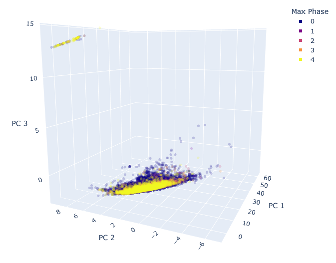
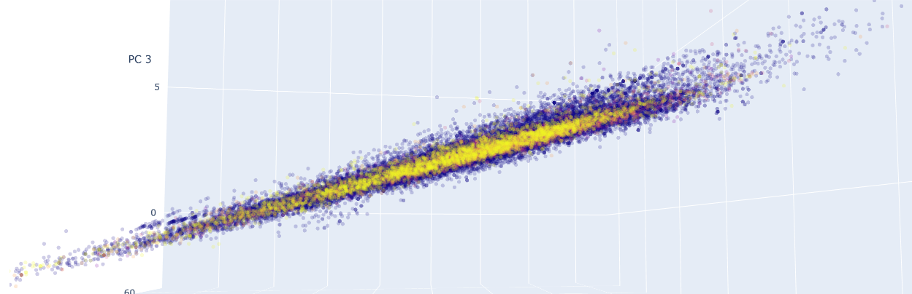

# Pharmaceutical Compound Data Mining

## Intro

In this project data mining (principal component analysis) is performed on a dataset of over 40,000 bioactive compounds, encompassing information on their structure and chemical properties.

 

   
  Projection of compounds by clinical research phase reached
 

 

The data obtained from the [ChEMBL](https://www.ebi.ac.uk/chembl/) database is extensive, but incomplete. Data cleaning and data augmentation are performed, whereby missing values are scraped or estimated through a linear regression model. In the cleaned dataset, each compound has different entries pertaining to its polarity, flexibility, bulkiness, composition, and hydrogen bond donors and acceptors. 

Dimensionality reduction is performed through principal component analysis where the 11-dimensional dataset is transformed to a 4-dimensional dataset maintaining ~85% of the original variation. The resulting data is plotted in 3D (the further dimension being represented through colour), where interesting patterns can be observed. 
 

## Data Cleaning and Augmentation

### Scraping

Text

### LogP Estimation

Text

 

   
  Caption
 

 

### Double Bond Equivalents

Text

## Analysis

Text

 

   
  Caption
 

 

## Insights

### Clinical Research Phase

Text

 

   
  Caption
 

 

 

   
  Caption
 

 

 

   
  Caption
 

 

### Target Organ System

Text

 

   
  Caption
 

 

 

   
  Caption
 

 

 

   
  Caption
 

 

## Requirements

python 3.x 
matplotlib 
numpy 
pandas 
plotly 
scikit-learn 
selenium 
wget 
Google Chrome Version 96.0.4664.110 
 
If you do not have it, this last item would need to be installed manually, but it is only necessary if you want to perform the data cleaning youself. 
You do not need it if you use the cleaned datasets provided in the main directory. 

## Usage

`git clone https://github.com/E-Fumi/PharmaDataMining.git` 
`cd PharmaDataMining` 
`pip install -r requirements.txt` 
`python main.py`
