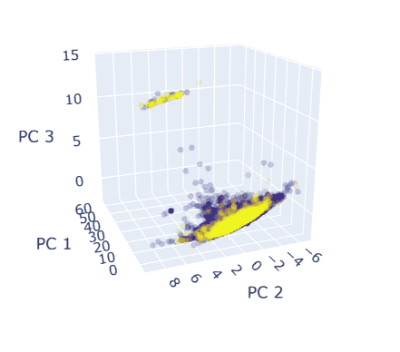

# PharmaDataMining

## Intro

In this project data mining (principal component analysis) is performed on a dataset of over 40,000 bioactive compounds, encompassing information pertaining to their structure and chemical properties.

 

   
  Caption
 

 

The data obtained from the ChEMBL database is extensive, but incomplete. Data cleaning and data augmentation are performed, whereby missing values are scraped or estimated through a linear regression model, and the structural rigidity of each molecule is quantified by calculating a further metric. In the cleaned dataset, each compound has different entries pertaining to its polarity, flexibility, bulkiness, composition, and hydrogen bond donors and acceptors. 

Dimensionality reduction is performed through principal component analysis where the 11-dimensional dataset is transformed to a 4-dimensional dataset maintaining ~85% of the original variation. The resulting data is plotted in 3D (the further dimension being represented through colour), where interesting patterns can be observed. 
